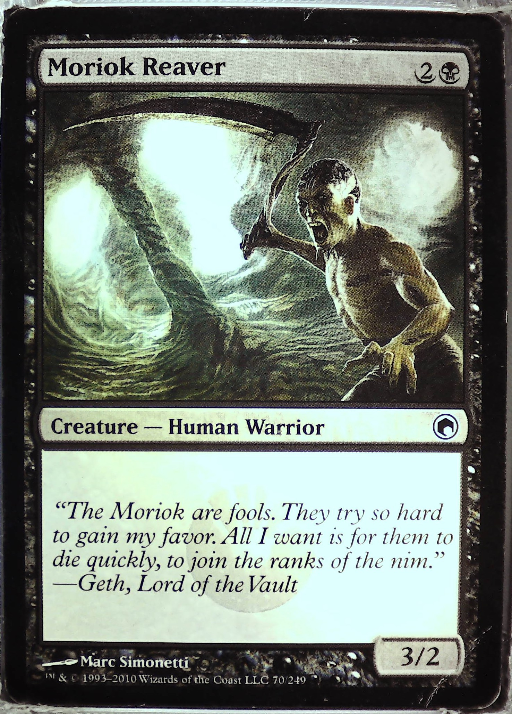
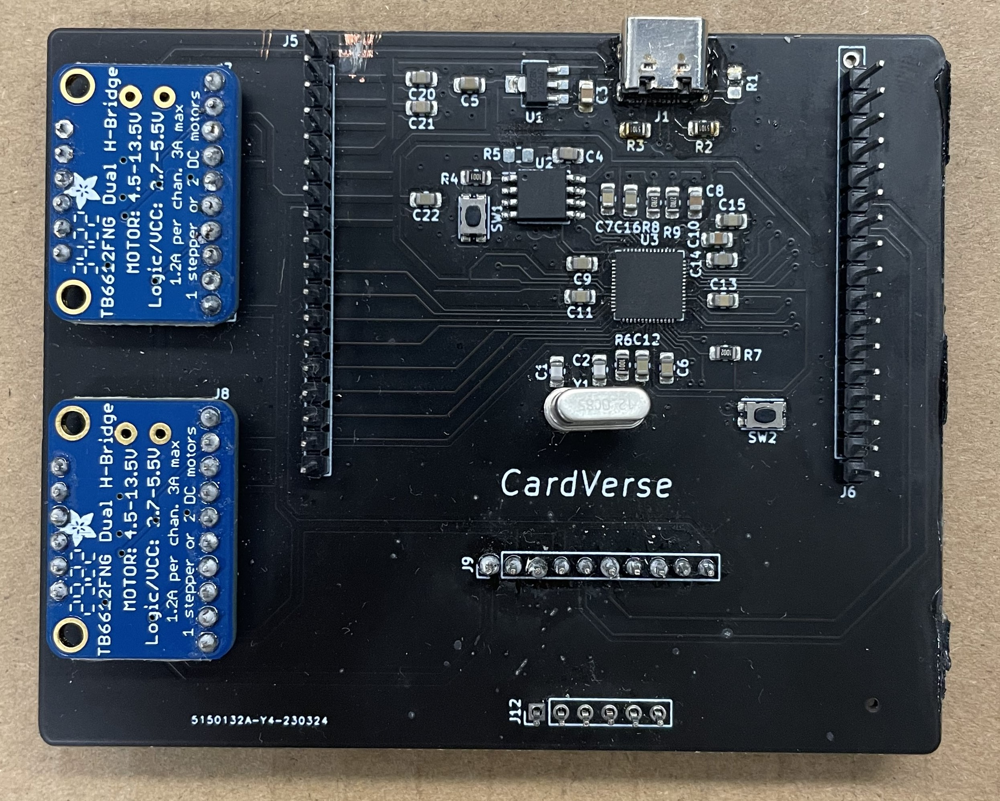
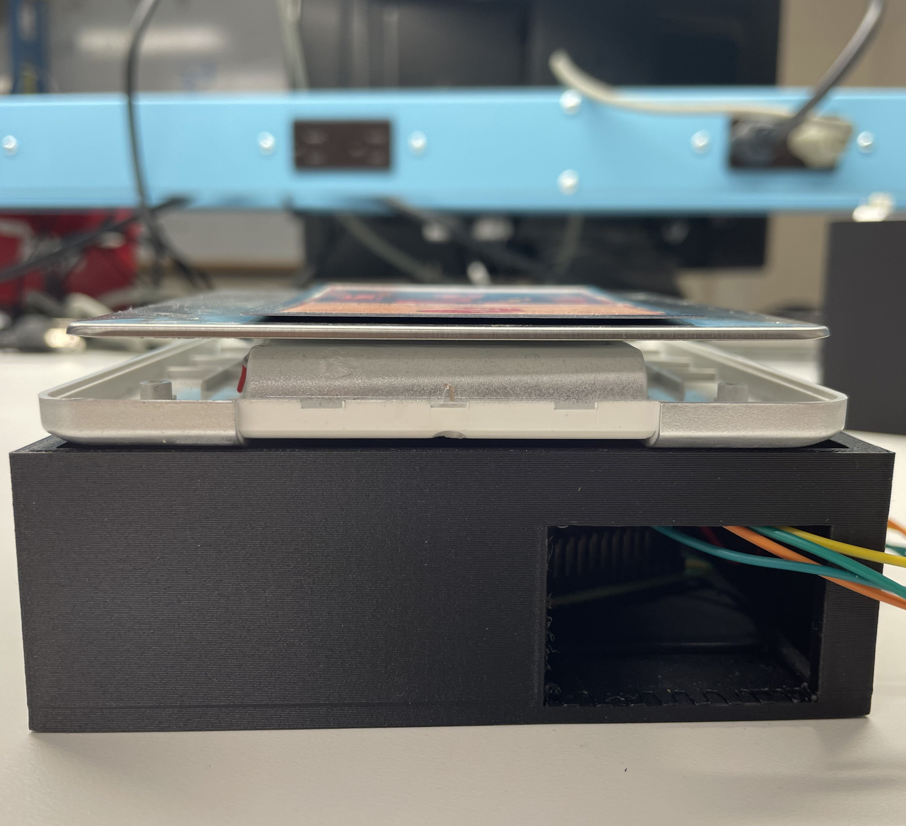

  

<nav style="text-align: center;">
    <ul>
        <a href="#whats-cardverse">What's CardVerse?</a> | 
        <a href="#impact">Impact</a> |
        <a href="#goals-and-motivation">Goals & Motivation</a> |
        <a href="#system-design-and-results">System Design & Results</a>
    </ul>
</nav>

    <video controls autoplay style="position: absolute; top: 0; left: 0; width: 100%; height: 100%;">
        <source src="assets/card_verse_work.mp4" type="video/mp4">
    </video>

<figcaption style="text-align: center;">Day 280 of 305</figcaption>

## What's CardVerse?
CardVerse is a machine capable of authenticating, grading, and sorting Magic: The Gathering cards with a throughput of 2 cards per minute with a total capacity of 1000 cards.

I, along with my team, developed this project as my ECE Senior Design Project. 

## Impact
Won a total of $7000 prize money at UMass's '22-'23 Berthiaume Innovation Challenge

>| UMass Business Plan Pitch 2022             | *$4,500 Second Place* |
| UMass Berthiaume Innovation Challenge 2023 | *$1,000 Top 5 Finalist* |
| UMass Entrepreneurship ULaunch 2022        | *$1,500 First Place*   |

## Goals and Motivation

Collectible card games (CCG) or Trading card games (TCG) are types of card games that combine strategic deck-building elements with features of trading cards. One of the earliest and most significant in terms of market and volume is a CCG named **Magic: The Gathering**.

Despite the enormous market, the industry faces several challenges:

- **Sophisticated Counterfeit Cards:**
  - Unnoticeable to the naked eye

- **Artificial Alterations on Defects:**
  - Ink tweaks to mask artifacts
  - Rebacked Cards (Splicing 2 Cards together)

- **Poor Card Conditions (Artifacts):**
  - Bends
  - Dents
  - Scratches

Given these issues, it becomes crucial to have a card graded and authenticated by a human expert before buying or selling. However, the current pipeline faces challenges with a scarcity of human experts and a large number of customers. This results in an extremely time-consuming and expensive process.

This is where **CardVerse** comes into play.

The project has 4 primary objectives:

1. **Artifact & Defects Detection:**
   - Trained a ***machine learning model (YOLOv8)*** on our custom dataset, which consisted of 500 cards evaluated by human experts.
   - The model achieved a ***97% accuracy*** in detecting defects when tested on a separate set of cards.

2. **Authenticity Detection:**
   - To determine the authenticity of a given card, we examined two aspects:
     1. ***Weight Test***
        - Since an original MTG card typically weighs between 1.7 and 1.8 grams, the system employs a weighing scale to identify counterfeit cards early in the pipeline.
     2. ***Rosette Pattern / Green Dot Test***
        - Designed an image processing pipeline (pattern matching & contouring) to conduct tests on the 40X zoom images of the card's [rosette pattern](https://www.mtginformation.com/counterfeits#:~:text=%E2%80%8B-,The%20Rosette%20Test,printings%20of%20the%20same%20set.) and the so-called [green dot](https://www.detecting-the-fakes.com/checking-details/green-dot-check/).
     3. Achieved a ***99% accuracy*** in authenticating a MTG card.

3. **Grading Schema:**
   - Developed a precise grading algorithm that objectively evaluates the condition and quality of the cards. The algorithm considers data points inferred from factors such as the ***type***, ***number***, and ***intensity*** of the defects mentioned above.

4. **Sorting Mechanism:**
   - The custom-built gantry system sorts the cards based on the output directed by the grading system.

## System Design and Results

### 1. Software Engineering

   - The machine comprises three stepper motors, two cameras, an imaging chamber equipped with 16 LEDs, a weighing scale, and a vacuum pump.
   - The system operates in conjunction with a Jetson Nano for executing inferences at the edge and a Raspberry Pi 4 for controlling the gantry, weighing scale, and imaging chamber. 
   - MQTT protocol was employed for communication between the Jetson Nano and Raspberry Pi 4.

### 2. Machine Learning & Image Processing
   - **Artifacts & Defects training**
   

      

         
      

      <figcaption style="font-size: smaller; text-align: center;">Example annotated image used in training</figcaption>
   

   

      

         
         
      

      <figcaption style="font-size: smaller; text-align: center;">Raw input image & Artifact detected output image</figcaption>
   

   - **Authenticity Detection**
   

      

         
         
      

      <figcaption style="font-size: smaller; text-align: center;">Rosette Pattern Analysis (Low Density when subjected to Pattern Matching) on counterfeit card</figcaption>
   

   

      

         
         
      

      <figcaption style="font-size: smaller; text-align: center;">Rosette Pattern Analysis (Higher Density when subjected to Pattern Matching) on authentic card</figcaption>
   

### 3. Embedded Systems
   - **Components**
   

      

         
      

      <figcaption style="font-size: smaller; text-align: center;">Custom RP2040 based PCB w/ stepper motor breakouts</figcaption>
   

### 4. Component Design & Fabrication
   - **Custom Components**
   

      

         
      

      <figcaption style="font-size: smaller; text-align: center;">Imaging Chamber w/ 16 LEDs</figcaption>
   

   

      

         
         
      

      <figcaption style="font-size: smaller; text-align: center;">Enclosure for the weighing scale, with Raspberry Pi underneath, together fitting inside the imaging chamber</figcaption>
   

   

      

         
      

      <figcaption style="font-size: smaller; text-align: center;">Z-axis Mount Combining a 40x Zoom Camera, 8MP Camera, and Suction Apparatus</figcaption>
   

***
[home](https://jatanjay.github.io/projects/)

